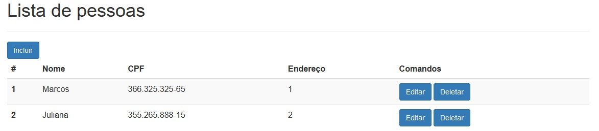

# Cadastro de pessoa usando php, laravel e postgreSql como banco de dados
Aplicação que consome api desenvolvida em .Net 5 e C#, usando o framework _Curl_ para o consumo.

|  Tela Pesquisa  | 
 ----------------- | 
|  |
Api utilizada: [BackEnd](https://github.com/MaiconMessias/api-net-core-cad-pessoa)

